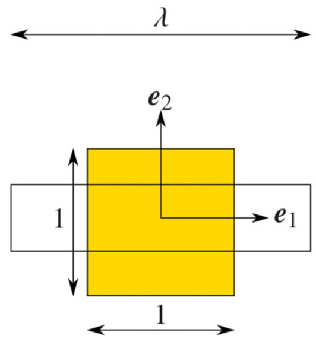

## Introduction

This code is aimed at the parameter identification of incompressible (rubber-like) hyperelastic material constitutive equation using MATLAB.

## ./Treloar-UT/, ./Treloar-ET and ./Treloar-PS

The directories contain stretch λ₁ and stress P₁ data in text file.

- **Uniaxial Tensile**

$$
F = \begin{bmatrix} \lambda & 0 & 0 \\ 0 & \frac{1}{\sqrt{\lambda}} & 0 \\ 0 & 0 & \frac{1}{\sqrt{\lambda}} \\ \end{bmatrix},\quad P = \begin{bmatrix} P_1 & 0 & 0 \\ 0 & 0 & 0 \\ 0 & 0 & 0 \\ \end{bmatrix}
$$

Note that $P_1 = \mathbf{P}_{11}$ and $\mathbf{P}_{22}=\mathbf{P}_{33}=0$, and the Cauchy stress tensor of incompressible hyperelastic material is

$$
\boldsymbol{\sigma} = -p\mathbf{I} + J^{-1}\mathbf{F}\mathbf{S}_{\mathrm{iso}}\mathbf{F}^{\mathrm{T}},\quad \mathbf{P} = J\boldsymbol{\sigma}\mathbf{F}^{-\mathrm{T}}=-Jp\mathbf{F}^{-\mathrm{T}}+\mathbf{F}\mathbf{S}_{\mathrm{iso}}
$$

$$
\mathbf{S}_{\mathrm{iso}}=2 \frac{\partial \Psi_{\mathrm{iso}}}{\partial \mathbf{C}}
$$

We use $\mathbf{P}_{22}=0$ to determine the expression of hydrostatic pressure $p$.

## Material Model

- **Ogden Model**

$$
\Psi_{\mathrm{Ogden}}=\Psi(\lambda_1,\lambda_2,\lambda_3)=\sum_{p=1}^3 \frac{\mu_p}{\alpha_p}\left(\lambda_1^{\alpha_p} + \lambda_2^{\alpha_p}+\lambda_3^{\alpha_p}-3\right)
$$

Referred to Ogden, R. W. (1972). Large deformation isotropic elasticity–on the correlation of theory and experiment for incompressible rubberlike solids. *Proceedings of the Royal Society of London. A. Mathematical and Physical Sciences*, *326*(1567), 565-584.

- **AB Model**

$$
\Psi_{\mathrm{AB}}(I_1)=nk\Theta\left[\frac{1}{2}(I_1-3)+\frac{1}{20N}(I_1^2-9)+\frac{11}{1050N^2}(I_1^3-27 )+ \frac{19}{7000N^3}(I_1^4-81)+\frac{519}{673750N^4}(I_1^5-243) \right]+\dots
$$

Referred to Arruda, E. M., & Boyce, M. C. (1993). A three-dimensional constitutive model for the large stretch behavior of rubber elastic materials. *Journal of the Mechanics and Physics of Solids*, *41*(2), 389-412.

- **CR Model**

$$
\Psi_{\mathrm{CR}}=\frac{\mu_1}{(m_1+n_1)^2}\sum_{i=1}^3 \left(\lambda_i^{m_1}-\lambda_i^{-n_1}\right)^2+\frac{\mu_2}{(m_2+n_2)^2}\sum_{i=1}^3 \left(\lambda_i^{m_2}-\lambda_i^{-n_2}\right)^2
$$

Referred to Darijani, H., Naghdabadi, R., & Kargarnovin, M. H. (2010). Hyperelastic materials modelling using a strain measure consistent with the strain energy postulates. *Proceedings of the Institution of Mechanical Engineers, Part C: Journal of Mechanical Engineering Science*, *224*(3), 591-602.

- **MR Model**

$$
\Psi_{\mathrm{MR}}=C_{10}(I_1-3)+C_{01}(I_2-3)
$$

Referred to Rivlin, R. S. (1948). Large elastic deformations of isotropic materials IV. Further developments of the general theory. *Philosophical transactions of the royal society of London. Series A, Mathematical and physical sciences*, *241*(835), 379-397.

- **Neo-Hookean Model**

$$
\Psi_{\mathrm{NeoHookean}}=\frac{\mu}{2} \left( I_1-3\right)
$$

Refer to Treloar, L. R. G. (1943). The elasticity of a network of long-chain molecules—II. *Transactions of the Faraday Society*, *39*, 241-246.

## lsqnonlin_fitting.m

This code use `lsqnonlin` to solve the least squares optimization problem, the objective function has the form of

$$
\begin{aligned}
\epsilon_{\mathrm{TOT}} &= \epsilon_{\mathrm{UT}}+\epsilon_{\mathrm{ET}}+\epsilon_{\mathrm{PS}}\\
&=\frac{1}{n_{\mathrm{UT}}}\sum_{i=1}^{n_{\mathrm{UT}}}\left(P_{1}(\boldsymbol{\xi},\lambda_i)-P_{1}^{\mathrm{exp}}(\lambda_i) \right)^2\\
&=\frac{1}{n_\mathrm{ET}}\sum_{i=1}^{n_{\mathrm{ET}}}\left(P_{1}(\boldsymbol{\xi},\lambda_i)-P_{1}^{\mathrm{exp}}(\lambda_i) \right)^2\\
&=\frac{1}{n_\mathrm{PS}}\sum_{i=1}^{n_{\mathrm{PS}}}\left(P_{1}(\boldsymbol{\xi},\lambda_i)-P_{1}^{\mathrm{exp}}(\lambda_i) \right)^2
\end{aligned}
$$

where $n_{(\cdot)}$ is the number of data sets in each case and $\boldsymbol{\xi}$ is the parameters to be identified. $P_{1}^{\mathrm{exp}}(\lambda_i)$ is the pricipal stress value corresponding to $\lambda_i$ in different loading case. The residual norm is defined as

$$
\begin{aligned}
R_{\mathrm{TOT}} &= R_{\mathrm{UT}}+R_{\mathrm{ET}}+R_{\mathrm{PS}}\\
&=\sum_{i=1}^{n_{\mathrm{UT}}}\left(P_{1}(\boldsymbol{\xi},\lambda_i)-P_{1}^{\mathrm{exp}}(\lambda_i) \right)^2\\
&+\sum_{i=1}^{n_{\mathrm{ET}}}\left(P_{1}(\boldsymbol{\xi},\lambda_i)-P_{1}^{\mathrm{exp}}(\lambda_i) \right)^2\\
&+\sum_{i=1}^{n_{\mathrm{PS}}}\left(P_{1}(\boldsymbol{\xi},\lambda_i)-P_{1}^{\mathrm{exp}}(\lambda_i) \right)^2
\end{aligned}
$$
